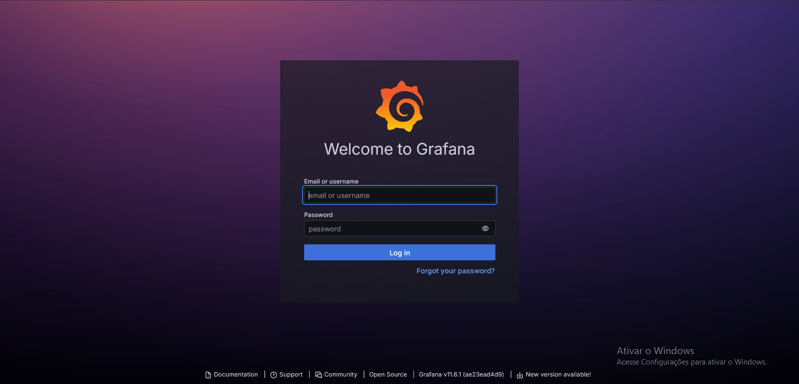
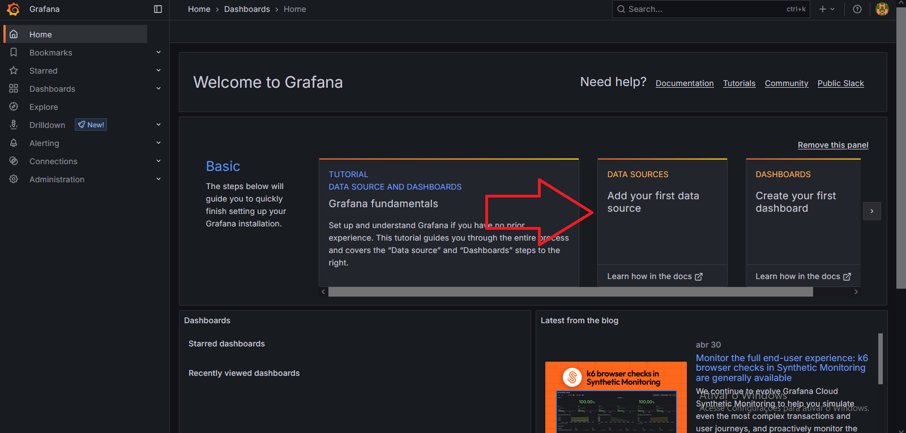
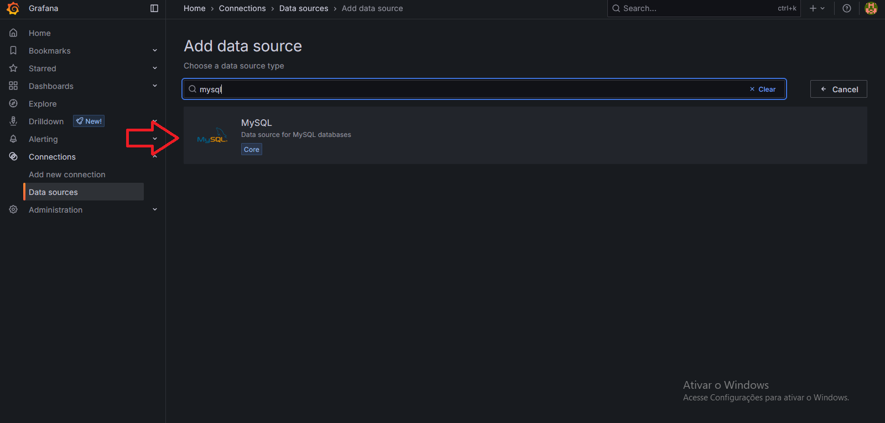
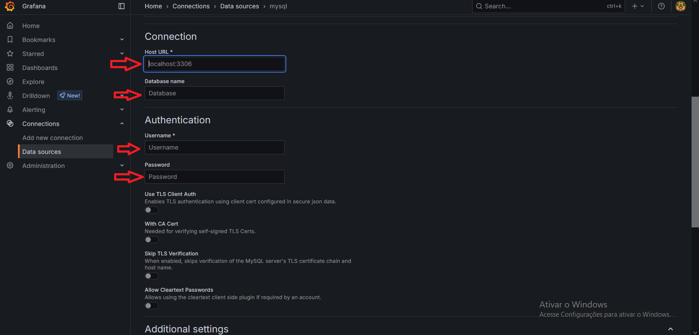
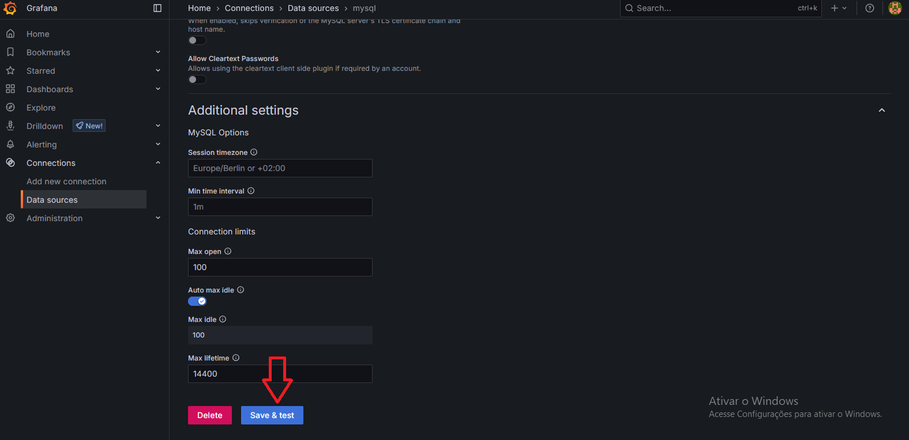
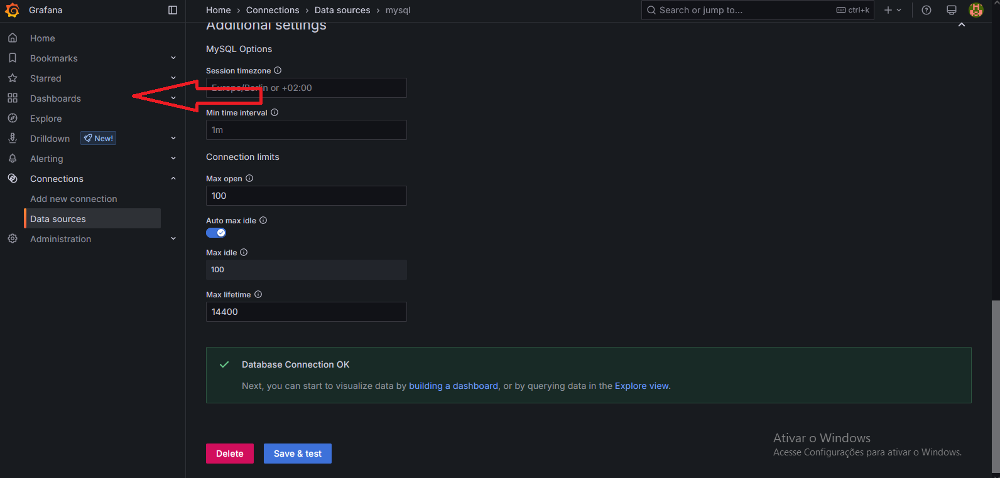
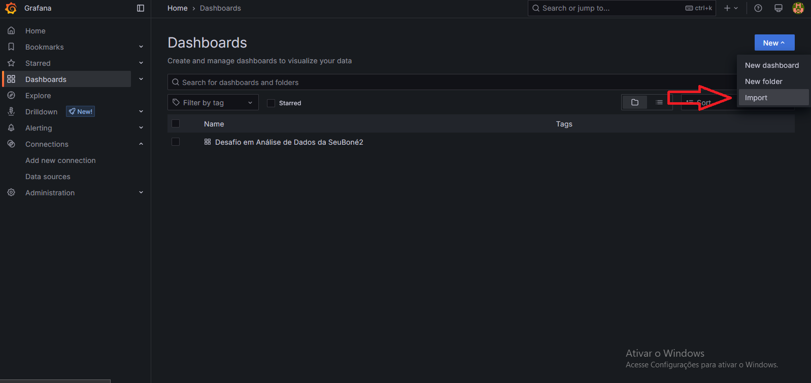
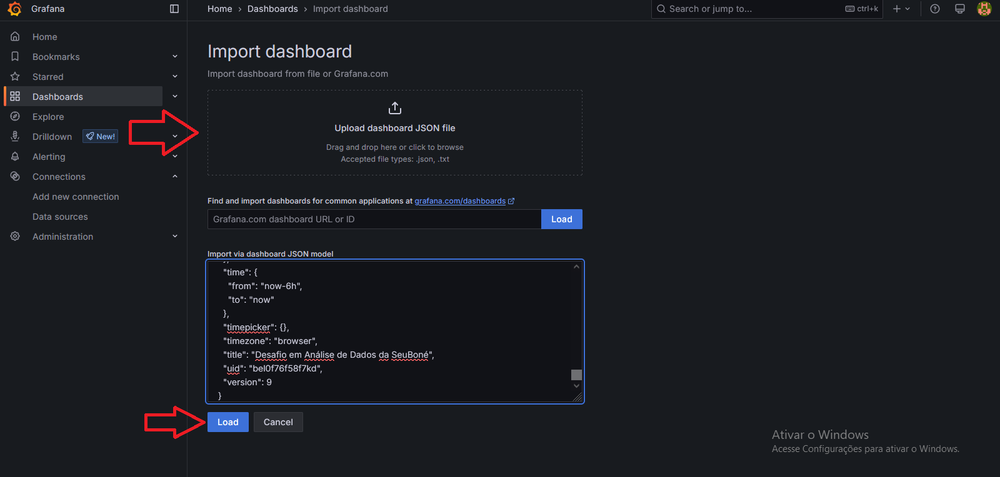
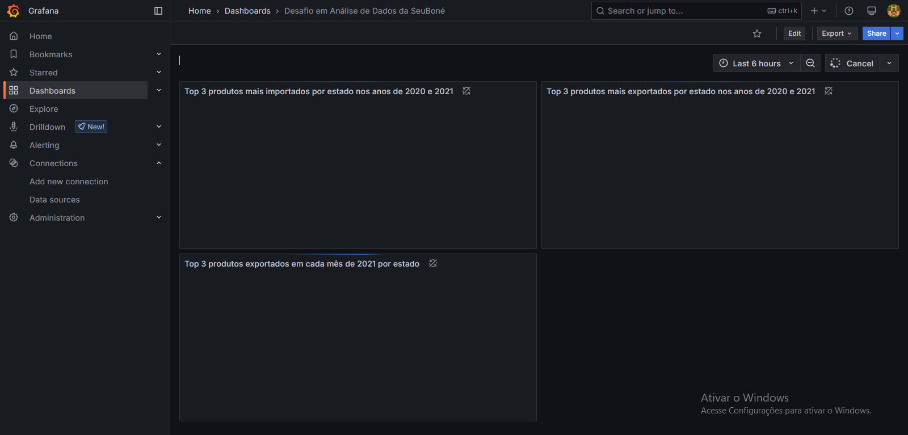

# Desafio em Análise de Dados da SeuBoné!

Links importantes:
- [Informações sobre layout de dados](https://www.gov.br/produtividade-e-comercio-exterior/pt-br/assuntos/comercio-exterior/estatisticas/base-de-dados-bruta
)
  - OBS: Utilizar "Base de dados detalhada por NCM"


<h1 id="usage" > 💻 Descrição </h1>

Projeto feito em python para o desafio de análise de dados da SeuBoné.

O desafio é dividido em duas partes:

1. Carregamento e armazenamento dos dados
2. Construção de visualizações a partir dos dados carregados.

- Utilizando grafana, foi criado um dashboard que exibe:
  - Qual os top 3 produtos mais exportados por estado nos anos de 2020 e 2021;
  - Qual os top 3 produtos mais importados por estado nos anos de 2020 e 2021;
  - Quais os top 3 produtos exportados em cada mês de 2021 por estado;

- Os dados utilizados foram os de comercio exterios do Brasil:
- [Informações sobre layout de dados](https://www.gov.br/produtividade-e-comercio-exterior/pt-br/assuntos/comercio-exterior/estatisticas/base-de-dados-bruta
)
  - OBS: Foi utilizada a "Base de dados detalhada por NCM".

<h1 id="usage" > 📚 Bibliotecas </h1>
- Numpy<br>
- Pandas<br>
- PyMySQL<br>
- python-dotenv<br>
- beautifulsoup4<br>
- requests<br>

<h2>👨‍💻 Como rodar o projeto</h2>

1. É necessario ter o <a href="https://www.python.org/">python 3</a> instalado, o pip e o docker.

2. Com o pip instalado é necessario instalar as bibliotecas, navegue até a raiz do projeto e rode.
```sh
    pip install numpy
```
```sh
    pip install pandas
```
```sh
    pip install PyMySQL
```
```sh
    pip install python-dotenv
```
```sh
    pip install beautifulsoup4
```
```sh
    pip install requests
```

3. Para praticidade o arquivo ```.env``` já está na raiz do projeto com as variaveis de ambiente definidas.

4. Agora é hora de subir os containers, garanta que não há nenhuma aplicação/banco de dados rodando nas portas ```3000``` e ```3306```, e após verificar isso, ainda na raiz do projeto, para subir os containers, rode:
```sh
    docker compose up -d
```

5. Com os container rodando, está na hora de carregar os dados no banco, note que exporrtação tem mais de 29 milhões de linhas e importação aproximadamente 40 milhões, então o processo vai demorar algum tempo para baixar, descompactar e inserir no banco. Para iniciar o processo, rode:
```sh
    python main.py
```

6. Enquanto os dados são processados, se pode cuidar dos dashboards, indo até um navegador, digite ```localhost:3000```, isso irá direciona-lo para a pagina do grafana.


7. Digite em usuario ```admin``` e em senha ```admin```, pressione enter e será exibido uma tela para definir uma nova senha, basta clicar em skip. E então será direcionado para a tela de home do grafana. Nela clique em ```add your firt data source```.


8. Pesquise na area barra de ```filter by name``` por ```mysql```e clique no resultado.


9. E agora preencha os campos ```Host URL``` com ```maria-db:3306```, ```Database name``` com ```projeto```, ```Username``` com ```root``` e ```Password``` com ```@%2025%@``` e deslize até o final da tela e clique em ```Save & test```.



10. E com o data source criado, na esqueda haverá alguns tópicos, clique em ```Dashboards```.
  

11. Na tela de dashboard va no canto superior direito e clique em ```New```, depois em ```Import```.


12. Agora na pagina de import iremos importar o dashboard. Na raiz do projeto, há uma pasta chamada ```grafana```, abra ela e depois abra a pasta ```dashboards```, e encontrará o arquivo ```seubone-dashboard.json```, você pode escolher arrastar esse arquivo até a area de ```Upload dashboar JSON file```, clicar nessa área e navegar até a pasta e selecionar o arquivo, ou copiar seu conteudo e colar no campo ```Import via dashboard JSON model``` e clique em ```load```.


13. Aguarde o dashboard realizar as pesquisas.


<h3>Autor</h3>
<a href="https://github.com/JoabUrbano">Joab Urbano</a><br>
